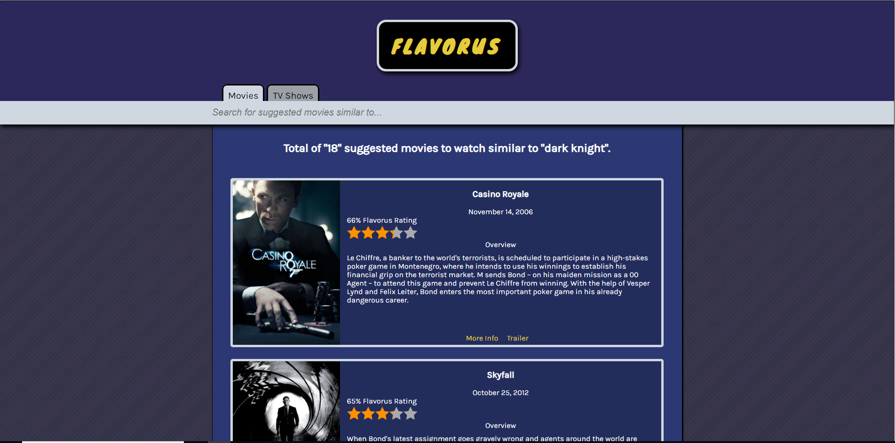

# Flavorus

An application for users to discover new movies and new tv shows based on a specific movie/tv show they love.

## Motivation

I am sure anyone and everyone who has finished watching a great movie or tv show wondered where they could search to find the next great entertainment experience. Instead of surfing the web for similar movies/tv shows and doing research on multiple sites, this application can help you find that all in one place.

## Screenshots

Landing Page:

Example Suggested Results Page:

## Built With

* HTML
* CSS
* JavaScript
* jQuery
* Tastedive API
* TMDB API

## Features

* Choice of entering a movie or tv show
* Uses Tastedive to acquire suggested results
* Provides top results first using a personal algorithm and data from TMDB's popularity/rating values
* Wikipedia link for more reading
* Youtube link to a trailer

## Author

* **Anawin Vanichyanukroh** - ** - Front-End Development, Testing, Styling

## Acknowledgments

* **Jay Kumar** - ** - Mentor, Consultant